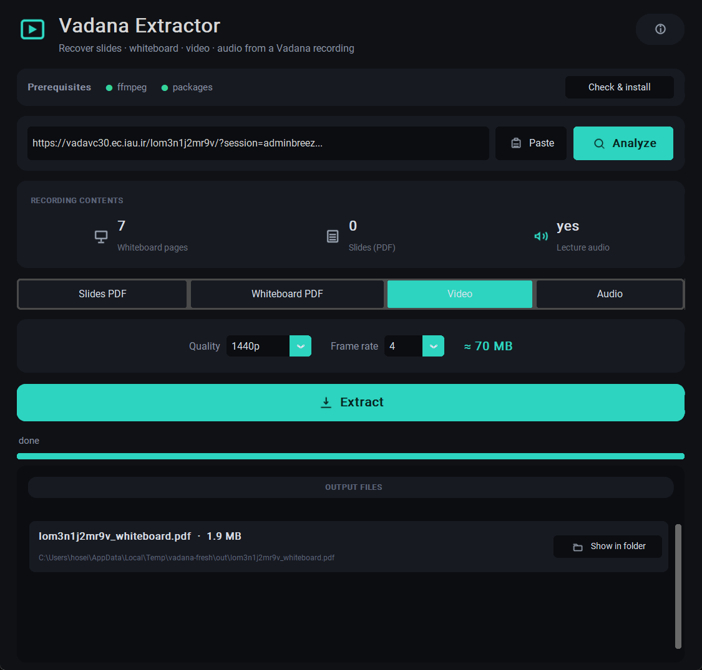
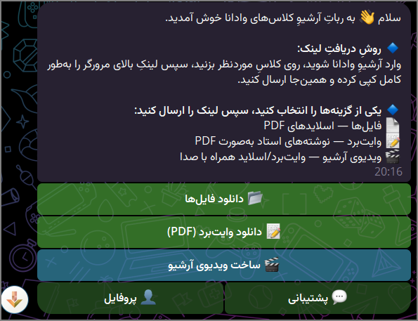
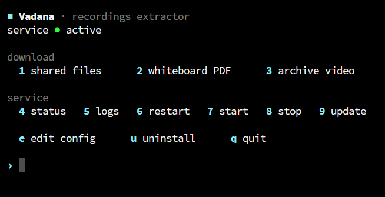

<div align="center">

# 🎓 Vadana Extractor

[](https://www.adobe.com/products/adobeconnect.html)
[](https://github.com/phoseinq/vadana-extractor/actions/workflows/ci.yml)
[](https://python.org)
[](https://core.telegram.org/bots)
[](https://ffmpeg.org)
[](LICENSE)

**Recover slides, whiteboard & a synced video from any Adobe Connect recording — IAU "Vadana" included**
**بازیابیِ اسلاید، وایت‌برد و ویدیوی همگام از هر ضبطِ ادوبی کانکت — از جمله «وادانا»ی دانشگاه آزاد**

### ▶️ Try the live bot — [@iau_archive_Bot](https://t.me/iau_archive_Bot)

[English](#english) · [فارسی](#فارسی)

</div>

<div align="center">



 

</div>

---

## English

### What it does

Pulls study material out of any Adobe Connect recording — straight from the recording's own offline package. It was built for IAU's "Vadana" servers (works with every branch — `vadavc30`, `vadana14`, `vadana36`, …), but that package layout is standard Adobe Connect, so any server works: just paste the full recording link. Most recordings open directly; some need a login.

It comes as a **Telegram bot** ([@iau_archive_Bot](https://t.me/iau_archive_Bot)) and two **CLI tools**.

- 📄 **Shared files** — the original PDF slides from the Share pod, even when the download button was off.
- 📝 **Whiteboard → PDF** — every board page as a clean PDF, strokes smoothed. If the professor drew on a shared PDF, that page stays behind the annotations.
- 🎬 **Synced video** — whiteboard + screen-share + audio on one timeline.
- 🖼️ **Preview + details** — each file arrives with a thumbnail and a short caption (id, date, size, length).
- 🤖 **Telegram bot** — send a link, pick what you want; live progress, Persian UI, a retry button.
- 🇮🇷 **Runs anywhere** — locally or on an Iran server with no proxy; a reverse proxy only when hosted abroad.

**Example** — one recording link, three possible outputs:

| You send | You get back |
| :-- | :-- |
| a link + 📄 **files** | the original slide PDFs (`Chapter 1.pdf`, `notes.docx`, …) |
| a link + 📝 **whiteboard** | one PDF of the board — the professor's notes laid over the slides |
| a link + 🎬 **video** | an MP4: whiteboard + screen-share + audio, page-synced |

### Requirements

- Python **3.11–3.13**
- `ffmpeg` + `ffprobe` on `PATH` (only for video)
- A bot token from [@BotFather](https://t.me/BotFather) (bot mode only)
- No proxy on a personal / Iran machine — only a reverse proxy when hosting abroad

### Quick start — interactive CLI (Windows / macOS / Linux)

Install [Python 3.11–3.13](https://www.python.org/downloads/) (tick **Add to PATH**) and, for video/audio, **ffmpeg** (`winget install ffmpeg`). Then:

```bash
git clone https://github.com/phoseinq/vadana-extractor
cd vadana-extractor
pip install -r requirements.txt
```

Run it with **one command** — on **Windows** just double-click **`vadana.bat`** (or run it from a terminal); on any OS:

```bash
python cli/vadana.py
```

It's fully guided: paste the recording link, it tells you what the recording actually contains (whiteboard / slides / audio), then you pick from a menu — **slides PDF**, **whiteboard PDF**, **synced video**, or **audio only (m4a or mp3)**. It loops, so you can grab several outputs — or several recordings — without re-running. Everything lands in `out/`.

<details><summary>Prefer one-shot commands?</summary>

```bash
python cli/download_slides.py "https://<connect-host>/<id>/"   # shared files
python cli/make_video.py "<url>"                               # synced video (audio-only -> .m4a)
python cli/make_video.py "<url>" --pages-only                  # board pages as a PDF
```
</details>

The plain link is usually enough. If a recording asks you to log in, copy the full link including its `session=` value (it expires fast).

### Desktop app (dark GUI)

Prefer a window over a terminal? On **Windows**, double-click **`vadana-gui.bat`** (it installs the one GUI dependency the first time and opens the app); on any OS:

```bash
pip install -r requirements-gui.txt
python gui/vadana_gui.py
```

Paste the link (there's a **Paste** button, so it works on any keyboard layout), hit **Analyze**, and it shows what the recording holds — whiteboard pages, slides, audio. Then pick **Slides PDF / Whiteboard PDF / Video / Audio**, choose the video **quality** (720p / 1080p / 1440p / 4K) and **frame rate**, or the audio **format** (m4a / mp3), and **Extract**. As you tweak the quality / frame rate it shows a live **size estimate**.

Dark theme with line icons, a **prerequisites** check that one-click installs what's missing (ffmpeg + packages), a **Cancel** button, **retry on error**, an **output-files** box (name, size, path, and *reveal in folder*), live progress, an on-screen + file log (`out/vadana.log`), and an **About** dialog. Everything is saved to `out/`.

### Bot setup

One command on the server. It asks Docker or native, installs everything (ffmpeg, the dependencies, the systemd service, the `vadana` command), then prints the next step.

```bash
curl -fsSL https://raw.githubusercontent.com/phoseinq/vadana-extractor/main/install.sh | bash
```

> **Docker** runs the published image `ghcr.io/phoseinq/vadana-extractor:latest` (CI pushes it on every release), so a Docker install — and `docker compose pull` — needs no local build; `build:` stays as a fallback.

Then fill in `bot/.env` (run `vadana env`, or edit it for Docker) and start. The settings:

| Variable | Meaning |
| :-- | :-- |
| `BOT_TOKEN` | token from [@BotFather](https://t.me/BotFather) — **required** |
| `IRAN_PROXY` | HTTP/SOCKS5 proxy, only when hosting abroad; empty otherwise |
| `ADMINS` | comma-separated user ids allowed to build videos |
| `STORAGE_CHANNEL` | private channel id used as a file cache (bot must be admin) |
| `ALLOW_VIDEO` | `1` = everyone can build videos; `0` = admin-only |
| `AUDIO_DENOISE` | speech cleanup on the video audio — a custom ffmpeg filter chain, or empty to turn it off (on by default) |

### The `vadana` command

| Command | Action |
| :-- | :-- |
| `vadana` | interactive menu |
| `files` / `whiteboard` / `video` | download that output |
| `status` / `logs` | service status / live logs |
| `start` / `stop` / `restart` | control the service |
| `update` | git pull + reinstall + restart |
| `env` | edit `.env`, then restart |
| `uninstall` | remove the service |

### How it works

Each recording exposes an offline ZIP at `/<id>/output/<id>.zip`. Shared documents come from `downloadUrl`s in `mainstream.xml`; the whiteboard is timed vector events in `ftcontent*.xml`, replayed to redraw the board; audio and screen-share are placed on the master timeline from `indexstream.xml` and muxed with FFmpeg.

### Architecture (for contributors)

The bot is one `aiogram` event loop. Every heavy step (download, whiteboard render, FFmpeg) runs in a worker thread via `asyncio.to_thread`, so the loop itself never blocks and stays responsive to other users.

**One job per user.** Each request becomes an `asyncio.Task` tracked in `ACTIVE_TASKS[uid]`; sending a second link while one is running is refused ("wait, or press Cancel"). Cancel sets an `asyncio.Event` the job polls, so it stops cleanly and frees its slot.

**Two semaphores cap the whole server** (not per-user):

- `SLIDES_SEM = Semaphore(MAX_CONCURRENT)` — default **3** — file / whiteboard downloads.
- `VIDEO_SEM = Semaphore(MAX_VIDEO_CONCURRENT)` — default **1** — video builds, which are the expensive ones (render + encode).

**Two people build a video at the same time:** the first `async with VIDEO_SEM:` takes the only slot and runs. The second sees `VIDEO_SEM.locked()`, switches its status message to "another video is building — yours starts next", and `await`s the semaphore. asyncio wakes waiters in arrival order, so it behaves as a FIFO queue — nobody is dropped, they just wait their turn. On a bigger box, raise `MAX_VIDEO_CONCURRENT`.

**Rate limits & anti-spam:** a per-user cooldown (`USER_COOLDOWN`, 15 s between requests) and a daily video quota (`MAX_VIDEO_PER_DAY`, 3 for non-admins, tracked in memory per day). A `ThrottleMiddleware` (outer middleware, ~10 updates per 8 s sliding window) drops floods *before* any handler or work runs; admins are exempt.

**Caching skips all of the above.** Every finished result is uploaded once to a storage channel and its Telegram `file_id` saved in `store.json`; a repeat request resends instantly from there — it never takes a semaphore or touches the source server.

Where to look: `bot/bot.py` (handlers, the two semaphores, the live-progress poller), `vadana/connect.py` (auth + package download), `vadana/whiteboard.py` + `vadana/video.py` (reconstruction), `vadana/slides.py` (shared files).

### Worker nodes (optional)

When the master's single video slot is busy, it can hand the heavy build to a remote **worker node** over mutually-authenticated TLS, so fewer jobs wait in the queue. The node is pure CPU + ffmpeg — it holds no Iran proxy and no Telegram token; the master ships it the recording package plus the shared PDFs in one bundle, the node renders, and posts the mp4 back. **Off by default — with no node connected, the master builds everything itself, exactly as before.**

```bash
vadana node add mynode       # issue a node cert + print one enrollment bundle (master IP auto-detected)
vadana node status            # which nodes are connected right now (live)
```

The node API turns **on automatically** once a node is registered (and off when the last one is removed) — `vadana node add`/`remove` restart the bot to apply. Force it with `vadana node on|off|auto`. The interactive `vadana` menu has a **Workers** section for all of this. The node side lives in its own repo: **[vadana-node](https://github.com/phoseinq/vadana-node)** (worker + Docker, multi-worker with `--workers`). Config:

| Variable | Meaning |
| :-- | :-- |
| `NODE_API_ENABLE` | override: `1`/`0` force on/off; unset = auto (on when ≥1 node registered) |
| `NODE_API_PORT` | mTLS port nodes connect to (default `8443`) |
| `HEARTBEAT_TTL` | seconds a node counts as "alive" since its last ping (default 30) |
| `CLAIM_TTL` | seconds before an undelivered job falls back to local (default 1200) |

### HTTP API (optional)

```bash
pip install -r requirements-api.txt
uvicorn cli.api:app --host 0.0.0.0 --port 8000
```

`POST /extract` with `{"url": "...", "kind": "files"}` returns a zip of the shared files (or `"kind": "whiteboard"` for the board PDF).

### Tests

```bash
pip install -r requirements-dev.txt
pytest
```

---

## فارسی

<div dir="rtl" align="right">

### چه‌کار می‌کند

جزوه و محتوای درسی را از هر ضبطِ ادوبی کانکت بیرون می‌کشد — مستقیم از پکیجِ آفلاینِ خودِ ضبط. برای سرورهای «وادانا»ی دانشگاه آزاد ساخته شده (با همهٔ شعبه‌ها کار می‌کند — `vadavc30`، `vadana14`، `vadana36`، …)، ولی این ساختارِ پکیج استانداردِ ادوبی کانکت است، پس روی هر سروری کار می‌کند: فقط لینکِ کاملِ ضبط را بفرست. بیشترِ ضبط‌ها مستقیم باز می‌شوند؛ بعضی‌ها به ورود نیاز دارند.

هم رباتِ تلگرام است ([@iau_archive_Bot](https://t.me/iau_archive_Bot))، هم دو ابزارِ خط‌فرمان.

- 📄 **فایل‌های اشتراکی** — همان PDFِ اصلِ اسلاید از Share pod، حتی وقتی دکمهٔ دانلود بسته بوده.
- 📝 **وایت‌برد ← PDF** — هر صفحهٔ تخته به‌صورتِ PDFِ تمیز، با خط‌های صاف‌شده. اگر استاد روی یک PDFِ اشتراکی نوشته باشد، همان صفحه پشتِ نوشته‌ها می‌ماند.
- 🎬 **ویدیوی همگام** — وایت‌برد + اشتراکِ صفحه + صدا روی یک تایم‌لاین.
- 🖼️ **پیش‌نمایش و جزئیات** — هر فایل با تامبنیل و یک کپشنِ کوتاه می‌رسد (شناسه، تاریخ، حجم، مدت).
- 🤖 **رباتِ تلگرام** — لینک را بفرست و انتخاب کن؛ نوارِ پیشرفتِ زنده، رابطِ فارسی، دکمهٔ تلاش مجدد.
- 🇮🇷 **همه‌جا کار می‌کند** — روی سیستمِ شخصی یا سرورِ ایران بدونِ پروکسی؛ پروکسیِ ریورس فقط روی سرورِ خارج.

**نمونه** — یک لینکِ ضبط، سه خروجیِ ممکن:

| می‌فرستی | می‌گیری |
| :-- | :-- |
| لینک + 📄 **فایل‌ها** | همان PDFهای اصلِ اسلاید (`Chapter 1.pdf`، …) |
| لینک + 📝 **وایت‌برد** | یک PDF از تخته — نوشته‌های استاد روی اسلایدها |
| لینک + 🎬 **ویدیو** | یک MP4: وایت‌برد + اشتراکِ صفحه + صدا، هماهنگ با صفحه‌ها |

### پیش‌نیازها

- پایتون **۳.۱۱ تا ۳.۱۳**
- `ffmpeg` و `ffprobe` روی `PATH` (فقط برای ویدیو)
- توکنِ ربات از [@BotFather](https://t.me/BotFather) (فقط حالتِ ربات)
- روی سیستمِ شخصی/ایران پروکسی لازم نیست — فقط روی سرورِ خارج یک پروکسیِ ریورس

### خط‌فرمانِ تعاملی (ویندوز / مک / لینوکس)

[پایتون ۳.۱۱ تا ۳.۱۳](https://www.python.org/downloads/) را نصب کن (گزینهٔ **Add to PATH** را بزن) و برای ویدیو/صدا هم **ffmpeg** را (`winget install ffmpeg`). بعد:

```bash
git clone https://github.com/phoseinq/vadana-extractor
cd vadana-extractor
pip install -r requirements.txt
```

با **یک دستور** اجرا کن — در **ویندوز** فقط روی **`vadana.bat`** دوبار کلیک کن (یا در ترمینال اجرا کن)؛ روی هر سیستمی:

```bash
python cli/vadana.py
```

کاملاً راهنمایی‌شده است: لینکِ ضبط را بزن، خودش می‌گوید ضبط چه دارد (وایت‌برد / اسلاید / صدا)، بعد از منو یکی را انتخاب کن — **اسلاید PDF**، **وایت‌برد PDF**، **ویدیوی همگام**، یا **فقط صدا (m4a یا mp3)**. حلقه می‌زند، پس بدونِ اجرای دوباره می‌توانی چند خروجی — یا چند ضبط — بگیری. همه‌چیز در `out/` ذخیره می‌شود.

<details><summary>دستورهای تک‌مرحله‌ای را ترجیح می‌دهی؟</summary>

```bash
python cli/download_slides.py "https://<connect-host>/<id>/"   # فایل‌های اشتراکی
python cli/make_video.py "<url>"                               # ویدیوی همگام (کلاسِ بی‌تصویر ← فایلِ ‎.m4a)
python cli/make_video.py "<url>" --pages-only                  # فقط صفحه‌های تخته (PDF)
```
</details>

معمولاً همین لینکِ ساده کافی است. اگر ضبطی به ورود نیاز داشت، لینکِ کامل همراه با مقدارِ `session=` را کپی کن (زود منقضی می‌شود).

### اپِ دسکتاپ (محیطِ گرافیکیِ دارک)

پنجره را به ترمینال ترجیح می‌دهی؟ در **ویندوز** فقط روی **`vadana-gui.bat`** دوبار کلیک کن (بارِ اول وابستگیِ گرافیکی را خودش نصب می‌کند و برنامه باز می‌شود)؛ روی هر سیستمی:

```bash
pip install -r requirements-gui.txt
python gui/vadana_gui.py
```

لینک را بزن (دکمهٔ **Paste** هم هست، پس با کیبوردِ فارسی هم کار می‌کند)، **Analyze** را بزن تا محتوای ضبط را نشان دهد (وایت‌برد، اسلاید، صدا). بعد یکی از **Slides PDF / Whiteboard PDF / Video / Audio** را انتخاب کن، **کیفیتِ** ویدیو (720p / 1080p / 1440p / 4K) و **فریم‌ریت**، یا **فرمتِ** صدا (m4a / mp3) را بچین و **Extract** بزن. با تغییرِ کیفیت و فریم‌ریت، **تخمینِ حجمِ نهایی** زنده نشان داده می‌شود.

تمِ دارک با آیکونِ خطی، **بررسیِ پیش‌نیازها** با نصبِ یک‌کلیکیِ موارد گم‌شده (ffmpeg + پکیج‌ها)، دکمهٔ **لغو**، **تلاشِ مجدد** هنگام خطا، **باکسِ فایل‌های خروجی** (نام، حجم، مسیر و «نمایش در پوشه»)، پیشرفتِ زنده، لاگِ روی صفحه و فایل (`out/vadana.log`)، و پنجرهٔ **About**. همه‌چیز در پوشهٔ `out/` ذخیره می‌شود.

### راه‌اندازیِ ربات

یک دستور روی سرور. می‌پرسد با داکر یا مستقیم، همه‌چیز را نصب می‌کند (ffmpeg، وابستگی‌ها، سرویسِ systemd و دستورِ `vadana`) و بعد قدمِ بعدی را نشان می‌دهد.

```bash
curl -fsSL https://raw.githubusercontent.com/phoseinq/vadana-extractor/main/install.sh | bash
```

> **داکر** ایمیجِ منتشرشدهٔ `ghcr.io/phoseinq/vadana-extractor:latest` را اجرا می‌کند (CI روی هر ریلیز پوش می‌کند)، پس نصبِ داکری — و `docker compose pull` — بدونِ build است؛ `build:` هم به‌عنوانِ fallback می‌ماند.

بعد `bot/.env` را پر کن (با `vadana env`، یا برای داکر دستی ویرایشش کن) و راه بینداز. تنظیمات:

| متغیر | توضیح |
| :-- | :-- |
| `BOT_TOKEN` | توکن از [@BotFather](https://t.me/BotFather) — **اجباری** |
| `IRAN_PROXY` | پروکسیِ HTTP/SOCKS5، فقط روی سرورِ خارج؛ وگرنه خالی |
| `ADMINS` | آی‌دیِ کاربرها (با کاما) که اجازهٔ ساختِ ویدیو دارند |
| `STORAGE_CHANNEL` | آی‌دیِ چنلِ خصوصی برای کشِ فایل‌ها (ربات باید ادمین باشد) |
| `ALLOW_VIDEO` | `۱` = ساختِ ویدیو برای همه؛ `۰` = فقط ادمین |
| `AUDIO_DENOISE` | نویزگیریِ صدای ویدیو — یک زنجیرهٔ فیلترِ ffmpeg دلخواه، یا خالی برای خاموش‌کردن (پیش‌فرض روشن) |

### دستورِ `vadana`

| دستور | کار |
| :-- | :-- |
| `vadana` | منوی تعاملی |
| `files` / `whiteboard` / `video` | دانلودِ همان خروجی |
| `status` / `logs` | وضعیتِ سرویس / لاگِ زنده |
| `start` / `stop` / `restart` | کنترلِ سرویس |
| `update` | git pull + نصبِ مجدد + ری‌استارت |
| `env` | ویرایشِ `.env` و ری‌استارت |
| `uninstall` | حذفِ سرویس |

### چطور کار می‌کند

هر ضبط یک ZIPِ آفلاین در `/<id>/output/<id>.zip` دارد. اسناد اشتراکی از `downloadUrl`های داخلِ `mainstream.xml` می‌آیند؛ وایت‌برد رویدادهای بُرداریِ زمان‌دار در `ftcontent*.xml` است که بازپخش می‌شود تا تخته دوباره کشیده شود؛ صدا و اشتراکِ صفحه با offsetهای `indexstream.xml` روی تایم‌لاین می‌نشینند و با FFmpeg ترکیب می‌شوند.

### نودهای کارگر (اختیاری)

وقتی تنها اسلاتِ ویدیوی مستر پر است، می‌تواند ساختِ سنگین را روی mTLS به یک **نودِ کارگرِ** دور بسپارد تا فایلِ کمتری در صف بماند. نود فقط CPU و ffmpeg است — پروکسیِ ایران و توکنِ تلگرام ندارد؛ مستر پکیجِ ضبط را همراهِ PDFهای اشتراکی در یک باندل می‌فرستد، نود رِندر می‌کند و MP4 را برمی‌گرداند. **پیش‌فرض خاموش — بدونِ نود، مستر دقیقاً مثلِ قبل خودش همه‌چیز را می‌سازد.**

```bash
vadana node add mynode       # صدورِ گواهیِ نود + چاپِ یک باندلِ ثبت‌نام (آی‌پیِ مستر خودکار)
vadana node status            # کدام نودها همین الان وصل‌اند (زنده)
```

APIِ نود **خودکار** روشن می‌شود وقتی حداقل یک نود ثبت شده باشد (و با حذفِ آخرین نود خاموش) — `add`/`remove` ربات را ری‌استارت می‌کنند تا اعمال شود. دستیِ‌اش: `vadana node on|off|auto`. منوی تعاملیِ `vadana` هم بخشِ **Workers** دارد. سمتِ نود ریپوی جداست: **[vadana-node](https://github.com/phoseinq/vadana-node)** (worker + Docker، چند-ورکر با `--workers`). تنظیماتِ مستر: `NODE_API_ENABLE` (override؛ پیش‌فرض auto)، `NODE_API_PORT` (۸۴۴۳)، `HEARTBEAT_TTL` (۳۰ث)، `CLAIM_TTL` (۱۲۰۰ث).

### API (اختیاری)

```bash
pip install -r requirements-api.txt
uvicorn cli.api:app --host 0.0.0.0 --port 8000
```

`POST /extract` با `{"url": "...", "kind": "files"}` یک zip از فایل‌ها برمی‌گرداند (یا با `"kind": "whiteboard"` همان PDFِ تخته).

### تست

```bash
pip install -r requirements-dev.txt
pytest
```

</div>

---

<div align="center"><sub>MIT · made by <a href="https://github.com/phoseinq">phoseinq</a> · <a href="https://pvboy.dev">pvboy.dev</a></sub></div>
